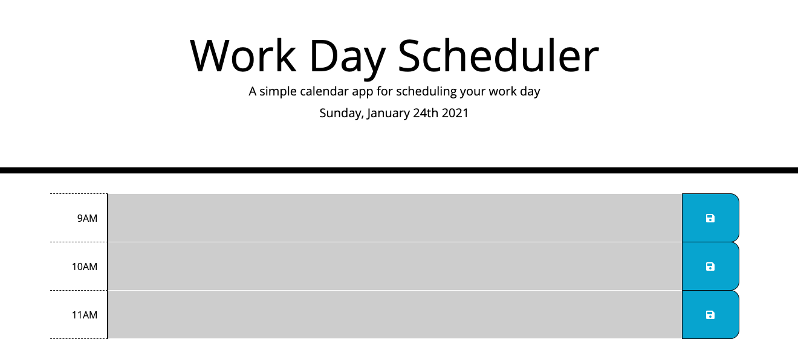

# workday-scheduler

## Description
Workday Scheduler is an interactive calendar that tracks the hours of your work day, lets you add and delete events or tasks throughout the day, and actively shows you the time by dynamically changing the background of text boxes based on the current time of day. Past hours are in grey, current hour is in red and future hours are in green. This application also uses local storage to save events/tasks through a page refresh. HTML, CSS, Javascript, Jquery, Bootstrap, GoogleFonts, Moment.js, and Font Awesome were used to build this page.

Come see the finished product! https://mrhumpherys.github.io/workday-scheduler/